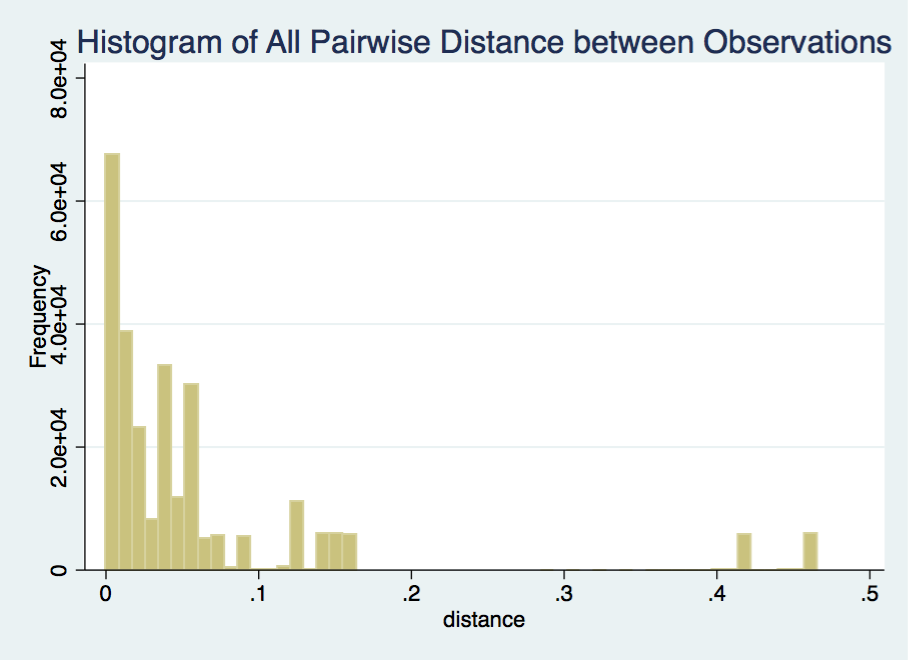
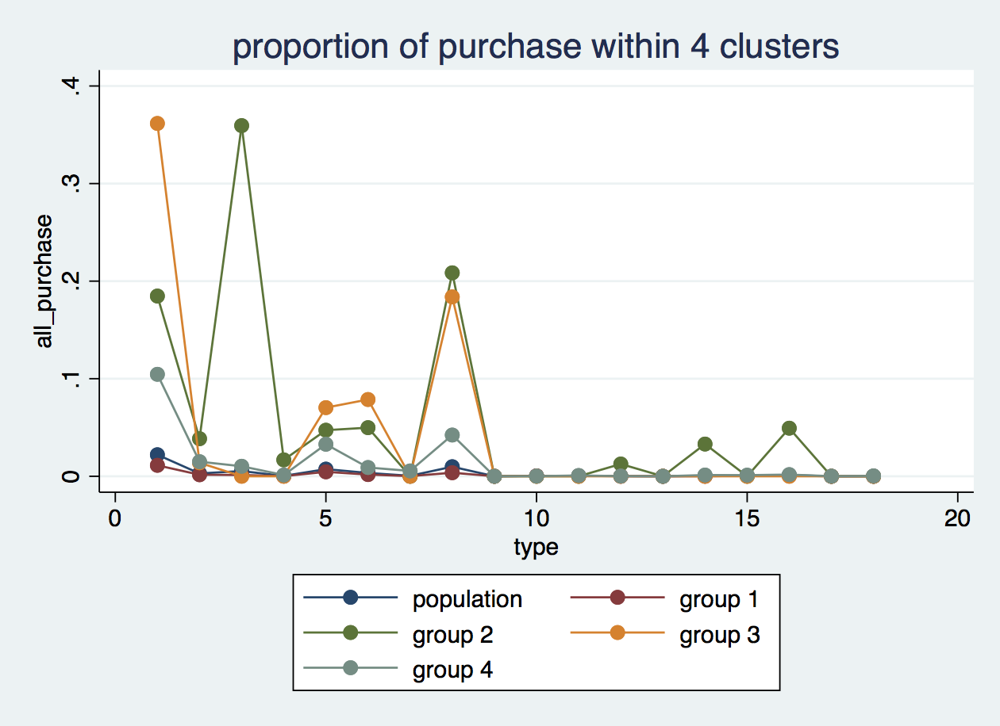
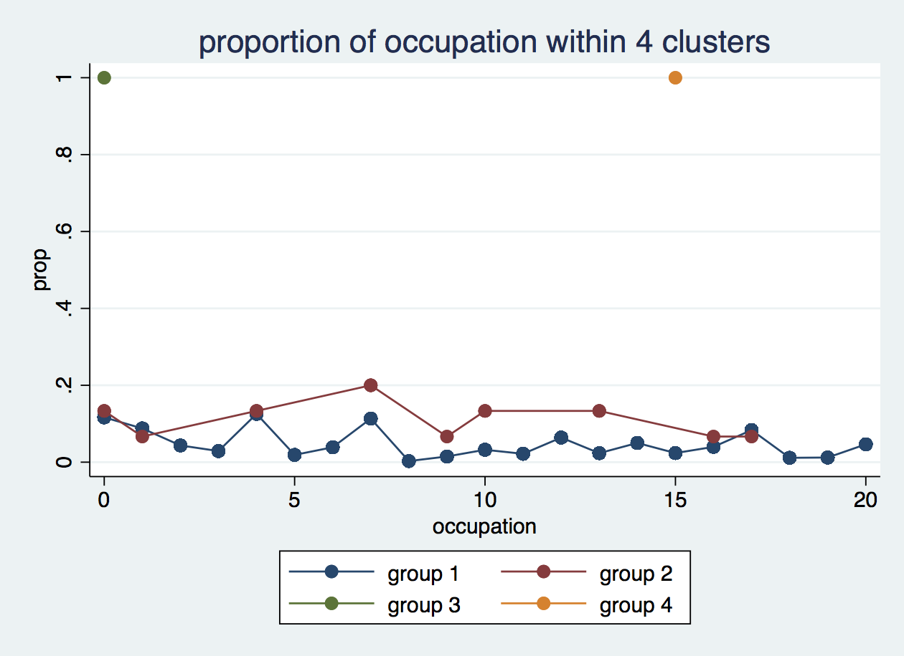
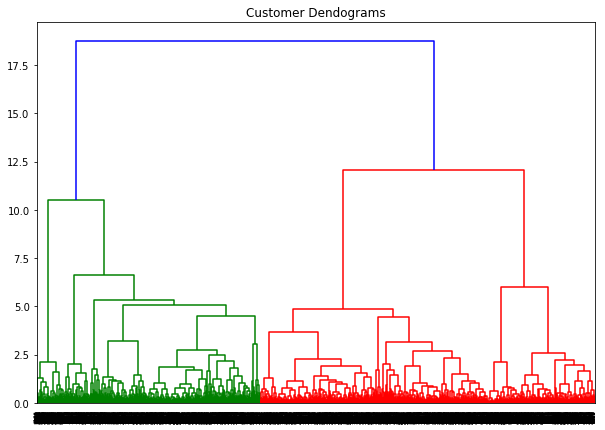

```{r setup, include=FALSE}

```

# Introduction to clustering analysis
[The hierarchical analysis][https://en.wikipedia.org/wiki/Hierarchical_clustering#Divisive_clustering] 

Divisive hierachical algorithms are built top-down: starting with the whole sample in a unique
cluster they split this cluster into two subclusters which are, in turn, divided into subclusters
and so on. At each step the two new clusters make up a so-called bipartition of the former. It
is well known (Edwards and Cavalli-Sforza 1965) that there are 2n - 1 – 1 ways of splitting a set
of n objects into two subsets. 

[Euclidean distance][https://en.wikipedia.org/wiki/Euclidean_distance]

$$
||a-b||_2 = \sqrt{\sum_i (a_i-b_i)^2}
$$

# Dataset used here 
## Source:
[Black Friday, Kaggle Reference][https://www.kaggle.com/mehdidag/black-friday]

The dataset here is a sample of the transactions made in a retail store. The store wants to know better the customer purchase behaviour against different products. 

Dataset of 550 000 observations about the black Friday in a retail store, it contains different kinds of variables either numerical or categorical.  
\
## Including Plots

## Variables inside:
User_ID: User ID \ 
Product_ID: Product ID \  
Gender: Sex of User  \
Age: Age in bins  \
Occupation: Occupation  \
City_Category: Category of the City: A,B,C \
Stay_In_Current_City_Years: Number of years stay in current city \
Marital_Status: Marital Status \
Product_Category_1: Product Category \
Product_Category_2: Product may belongs to other category also \
Product_Category_3: Product may belongs to other category also \
Purchase: Purchase amount in dollars \
\


## Goal:
By saying predict customer preference, we expect to find informative characteristics of each group after clustering.
we plan to use a few of the attributes in the data only for segmentation and the remaining only to profile the clusters. These profiling attributes (e.g. demographic and behavioral data) would help us better understand patterns of different customer groups. Meantime, we expect to check robustness of our hierarchical clustering models by comparing similarity between these profiling variables.

```{r,echo=FALSE,message=FALSE}
library("dplyr")
#require(knitr)
#opts_chunk$set(engine="stata", comment="")
```
# Running divisive clustering analysis in STATA
Similar to R and Python, we need to first import the dataset into STATA. We use the "import delimited" command. \
import delimited "/Users/meng/Downloads/BlackFriday.csv"

We only use information in "product_category_1" for clustering analysi considered too many missing values 
in another two categories. In our clustering model, we use customer preference, defined as proporation of expense in 
each product category, to help identify market segments and use some of the remaining geo-demographic attribututes to profile the clusters. Therefore, we later reshaped the dataset to the wide format and obtain 18 different variables.  \
reshape wide all_purchase, i(user_id) j(product_category_1)


To gain a overview of our consumer's shopping preference, we use summarize command. 
Since our goal is to group customer based on how similiar taste they have for shopping, we use Euclidean distance measure as well as average linkage method. With list command, the distance betweem the first ten consumers, using their shopping behaviors, are: \
list dist_1-dist_5 in 1/5

Later, to provide a first understanding of the dataset, we draw a histogram graph of all pairwise distance for eucliean distance. The "mountain an valleys" patterns in the graph indicates there indeed multiple fragments in the dataset. \
hist distance, freq title("histogram of pairwise distances") 

 {width=50%}


Unlike R, there is no relevant command to compute divisive hierarchical clustering analysis. We thus write our own programming command "Diana" with reference to Kaufman, L. and Pousseeuw, P.J. (1999). The alogrithm is fully describe in Chapter 6. Even though it has reduced the computation cost quite a lot, it still takes much time for the loop compared with agglomerative hierarchical clustering method. For simplicity, we at first look at the 4-segments solution and the segmentation result is shown as following for the first 10 consumers in the dataset. \
**list group in 1/10
```{r,echo=FALSE}
data=read.csv("./datacluster.csv",header=T)
knitr::kable(data[1:10,2:3],col.names = c("user_id","cluster_group"))
```


We also plot a line chart to compare difference between groups: \

 {width=50%}
 
 
Combined demographic features, we use the following plots to help detect divergence among these four clusters:\

 {width=50%}
 


# Running divisive clustering analysis in Python
First, we need to clean and reshape the huge dataset, keeping informative columns ('User_ID', 'Product_Category_1' and 'Purchase' in our case) and converting to a wide readable table. Using pandas package in Python, we follow the similar ideas as using dyplr in R. First of all, calculating the individual purchasing percentage under each category over years. Then, reshaping the long table to a wide form with customers' ID as the row names, and the categorical index of products as the column names. \

Since there is no built-in Python package or method for divisive clustering. We write several functions based on the principle of algorithm. The first step is to construct a dissimilarity matrix, which is symmerical. \

However, so far, the dissimilarity matrix is 5891 by 5891, which is still too big for clustering. We also noticed extreme data points have huge effect to the outcome. More adjustments (e.g. introducing criterions) will be implemented in the furture steps. \

For the last attempt, we implement the ward linkage which performs agglomerative hierarchical clustering as a comparison of what we got from R and Stata. Obviously, the 'Customer Dendograms' indicate having four clusters is not enough for analysis. More modifications will be needed. \
 {width=50%}


# Running divisive clustering analysis in R
```{r echo=TRUE, message=FALSE, warning=FALSE, paged.print=FALSE}
# Load all the libraries we need for our analysis:
library(sqldf)
library(cluster)
library(ggplot2)
library(tidyr)
library(dplyr)
# We need to load data into R by using read.csv since it’s in csv format.
data=read.csv("https://raw.githubusercontent.com/Anranmg/project506/master/BlackFriday.csv",header=TRUE, sep=',')

# Because product category2 and category3 are products belong to other catagory, it recalculate same product, we drop these two category.
# By manipulating data, we get a new dataset with user_id and 18 category1 ratios for each user.
data=data %>%
  select(-Product_ID,-Product_Category_2,-Product_Category_3)%>%
  group_by(User_ID)%>%
  mutate(total=sum(Purchase))%>%
  group_by(User_ID,Product_Category_1)%>%
  summarise(Purchase=sum(Purchase),total=mean(total))%>%
  mutate(Purchase=Purchase/total)%>%
  spread(Product_Category_1,Purchase)%>%
  replace(.,is.na(.),0)%>%
  select(-total)

# Since the dataset is so large, it will takes more than 10 mins to run, we choose first 100 data to just show 
# one result.
data = head(data, n = 100)

```

```{r message=FALSE, warning=FALSE, include=FALSE, paged.print=FALSE}
# Check the data structure by using: 
str(data)

```

```{r echo=TRUE, message=FALSE, warning=FALSE, paged.print=FALSE}
# Standardization data
data2 = data[2:19]
data1 = scale(data[2:19])

# Using diana cluster to cluster, and get the dendrogram of diana.
# And we use euclidean method to calculate distance.
sol = diana(data2, metric = "euclidean", stand = TRUE)
pltree(sol, cex = 0.3, hang = -1)
```


```{r echo=TRUE, message=FALSE, warning=FALSE, paged.print=FALSE}
# Just for test, we choose k=4 to cluster data into 4 groups.
cluster_id = cutree(as.hclust(sol), k = 4)

# Check the number of each cluster
table(cluster_id)
```

```{r echo=TRUE, message=FALSE, warning=FALSE, paged.print=FALSE}
data_cluster = data.frame(cluster_id)
tmp=cbind(cluster_id=data_cluster$cluster_id,data)
data_all=sqldf('select a.*,b.cluster_id from data as a left join tmp as b on a.User_ID=b.User_ID')

# Select cluster number to generate barplot of category ratio in cluster 1. 
cluster_data=sqldf('select a.* from data_all as a where a.cluster_id = 1')
# Summary cluster data.
summary(cluster_data)
plot_data = colMeans(cluster_data)
barplot(plot_data[2:19])

# Select cluster number to generate barplot of category ratio in cluster 2. 
cluster_data=sqldf('select a.* from data_all as a where a.cluster_id = 2')
plot_data = colMeans(cluster_data)
barplot(plot_data[2:19])

# Select cluster number to generate barplot of category ratio in cluster 3. 
cluster_data=sqldf('select a.* from data_all as a where a.cluster_id = 3')
plot_data = colMeans(cluster_data)
barplot(plot_data[2:19])

# Select cluster number to generate barplot of category ratio in cluster 4. 
cluster_data=sqldf('select a.* from data_all as a where a.cluster_id = 4')
plot_data = colMeans(cluster_data)
barplot(plot_data[2:19])
```


# Outline
The temporary clustering result seems not very good as we expected. Considered huge computation cost at divisive hierarchical clustering method, we plan to improve it from three ways: \
1. sample size reduction.  \
2. changes on segement attributes \
3. adjustment on our clustering method if possible \

#to do list
1. We found our data is too big to handle(cleaned and reshaped version is a data frame of size 5891 by 81). Calculations are time-consuming.

2. There are no built-in package or method in Python and Stata that can sufficiently support the divisive algorithm.

Writing functions based on the theory itself is hard to debug and beyond our current understanding.

3. For the final project, we are thinking about dimensionality reduction modeling, plus K-means clustering.

# reference 
Finding groups in data: An introduction to cluster analysis

[Cluster Analysis and Segmentation][https://inseaddataanalytics.github.io/INSEADAnalytics/CourseSessions/Sessions45/ClusterAnalysisReading.html#clustering_and_segmentation_using_an_example]